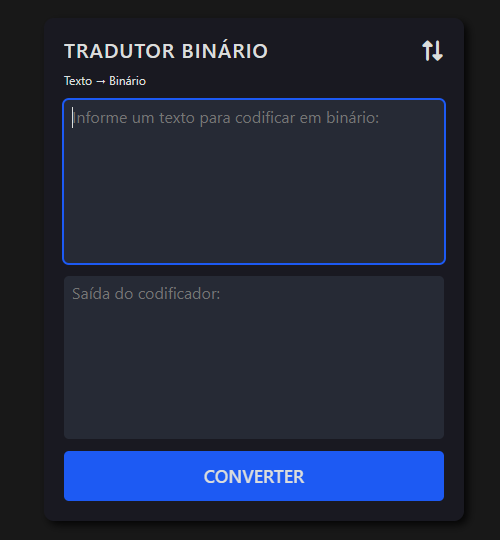

# Tradutor Binário
Este é um pequeno aplicativo web que permite converter texto em binário e vice-versa. Ele oferece uma interface amigável onde você pode inserir seus dados e obter a conversão, instantaneamente.

## Como Utilizar
> - O botão de troca de conversão: Escolha se deseja converter de texto para binário ou de binário para texto utilizando do botão fornecido.
> - Inserir Texto ou binário: Digite a informa que deseja converter no campo de entrada correspondente.
> - Converter: Clique no botão "Converter" para realizar a conversão.
> - Resultado: O texto ou binário convertido será exibido na área de saída abaixo dos campos de entrada.

## Tecnologias Utilizadas
Este projeto é construído utilizando as seguintes tecnologias:

> - HTML
> - CSS
> - JavaScript

## Configuração
Para executar este projeto localmente, siga estes passos:

- Faça download do repositório na sua máquina local.
- Abra o arquivo **"index.html"** em seu navegador da web preferido.

## Visual

## Funcionalidades
> - Conversão de Texto para Binário
> - Conversão de Binário para Texto
> - Interface Amigável para o Usuário

## Agradecimento
Este projeto foi criado como um exercício de aprendizado.
